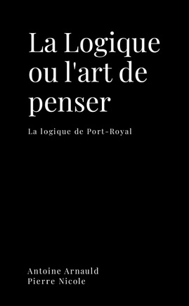

Réédition élégante de _La Logique ou l'art de penser_, d'Antoine Arnauld et Pierre Nicole, première édition (1662).

<p align="center">
<a href="https://www.lulu.com/shop/pierre-nicole-and-antoine-arnauld/la-logique-ou-lart-de-penser/paperback/product-gjnqvk8.html?q=La+logique+ou+l%27art+de+penser+-+Premi%C3%A8re+%C3%A9dition+%28poche%29&page=1&pageSize=4"></a>
</p>

> La plus belle édition jamais parue!
>
> -- _Un ami de la famille_

## 📖 Format papier

| [](https://www.lulu.com/shop/pierre-nicole-and-antoine-arnauld/la-logique-ou-lart-de-penser/paperback/product-gjnqvk8.html?q=La+logique+ou+l%27art+de+penser+-+Premi%C3%A8re+%C3%A9dition+%28poche%29&page=1&pageSize=4)|
|:---------------------:|
| Format poche, couverture souple, 500 pages ([🛒 disponible ici](https://www.lulu.com/shop/pierre-nicole-and-antoine-arnauld/la-logique-ou-lart-de-penser/paperback/product-gjnqvk8.html?q=La+logique+ou+l%27art+de+penser+-+Premi%C3%A8re+%C3%A9dition+%28poche%29&page=1&pageSize=4)) |

## 💾 Format numérique

La version électronique est gratuite! ([📖 feuilleter](La_logique_de_Port-Royal.pdf))

Pour compiler depuis la source:

```console
xelatex La_logique_de_Port-Royal.tex
```
